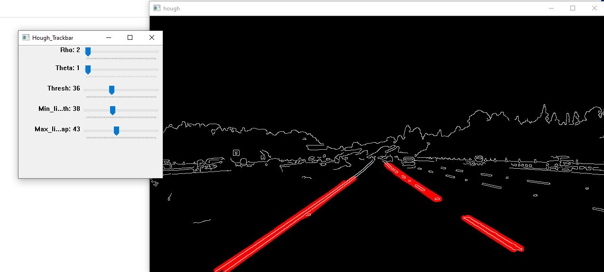

# **Finding Lane Lines on the Road** 
[](http://www.udacity.com/drive)


<h2> Introduction </h2>
  <p>The project focusses on lane dectetion in images as well as in video using OpenCV. The pipeline is as below.
    <UL>
      <LI> The colour image or the video frame is converted into gray scale.</LI>
      <LI> Now a Gaussian Blur is added to the image with a kernel size of 5X5 </LI>
      <LI> Now Canny edge detection algorithm is applied to this image to get the edges in the image. It uses a gradients to find out the edges.</LI>
      <LI> The threshold values are chosen between 50 and 150 </LI>
      <LI> Now we crop the image to get more focus on the road section of the image thereby eliminating the sky areas. </LI>
      <LI> We use OpenCV fillPoly function to get the mask of the road surface and then bitwise and with the image from Canny. </LI>
      <LI> Now we have the edges of the roads and we need to connect the nearby edges to get the lanes </LI>
      <LI> We use Hough transform to get the lines with the parameters.</LI>
        <UL>
          <LI> rho=2  </LI>
          <LI> theta=pi/180 </LI>
          <LI> thresh=36 </LI>
          <LI> min_line_length=38 </LI>
          <LI> max_line_gap=43 </LI>
        </UL>
  </UL>
  </p>

<h2> Project Setup </h2>

```
Install cv2 library
Select the corresponding image file and run Project.py
For Easier tuning of hyper parameters for Hough Transform use Project1tune.py
For Videos select the appropriate video and run Projectvideo.py
The Challenge Video is solved by running Projectchallenge.py
Use only VLC player to open the video in Output.
```
<h2> Project Structure and Execution </h2>

```
The Code in Project.py works for all images with the hyperparameters for hough transform as above.
The Code in Projectvideo.py works for videos with the hyperparameters tuned for solidWhiteRight.mp4 and solidYellowLeft.mp4
The Code in Projectchallenge.py works for videos with hyperparameters tuned for challenge.mp4

```

<h2> Project Images </h2>
<p> The Output images and video are located in Output Folders </p>

<h3> Sample output image after lane detection </h3>


<h3> Image of Tuner </h3>



<h2> Shortcomings </h2>
  <p> The current pipelines shows a major defect while gathering a distinction between the natural sunlight and marked lines on the road which is also white. Also the camera position plays a crucial role in the code stability, so that we don't need to change the change the boundaries of the polygon while masking the road surface in the image neglecting the sky areas. </p>
